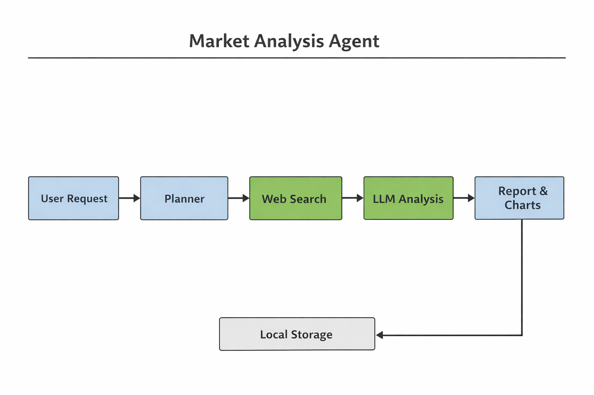

# Market Analysis Agent

This project implements a small agent-style system that generates a
market analysis report for a product in a given region.

The user provides:

-   a product name
-   a region
-   a request such as **"Generate a market analysis report"**

The system then performs several steps automatically:

1.  Search the web for relevant information about the product
2.  Extract structured insights from the retrieved sources
3.  Generate a written market analysis report
4.  Produce simple visualizations
5.  Store the report artifacts locally

The goal is to demonstrate how an AI agent can orchestrate external
tools (search, reasoning, and report generation) to produce a structured
analysis.

------------------------------------------------------------------------

# Architecture


High level flow:

    User Request
          ↓
    Planner
          ↓
    Web Research Tool
          ↓
    LLM Insight Extraction
          ↓
    Report Generation
          ↓
    Charts & Visualizations
          ↓
    Local Storage

------------------------------------------------------------------------

# Project Structure

    Market_cruncher_demo_ai
    │
    ├── app/
    │   ├── main.py
    │   ├── routes.py
    │   ├── orchestrator.py
    │   ├── planner.py
    │   ├── schemas.py
    │   ├── llm_client.py
    │   ├── report_store.py
    │   ├── report_formatter.py
    │   └── visualizations.py
    │
    ├── tools/
    │   └── web_research.py
    │
    ├── tests/
    │   ├── test_api.py
    │   ├── test_orchestrator.py
    │   └── test_web_research.py
    │
    ├── reports/
    │
    ├── docs/
    │   └── architecture.png
    │
    ├── Dockerfile
    ├── requirements.txt
    └── README.md

Main components:

**Planner**\
Determines which tools should be executed for a request.

**Orchestrator**\
Coordinates the workflow and runs the tools in sequence.

**Tools**\
External capabilities used by the agent (for example web search).

**LLM Client**\
Handles calls to the language model for insight extraction and report
generation.

**Report Generator**\
Formats the final report and produces charts.

**Storage Layer**\
Stores generated artifacts locally.

------------------------------------------------------------------------

# Workflow

Typical execution flow:

    User request
       ↓
    Planner decides which tools to use
       ↓
    Web search retrieves evidence
       ↓
    LLM extracts structured insights
       ↓
    LLM generates market report
       ↓
    Charts are generated
       ↓
    Artifacts are stored locally

The API response returns:

-   the execution plan
-   retrieved search results
-   extracted market insights
-   the generated report
-   the location where artifacts were stored
-   
### Design Decisions: Why a Deterministic Planner?

I chose a native Python orchestrator with a rule-based planner instead of a full LLM-driven router. While an LLM could decide which tools to run, using a deterministic approach here guarantees 100% reliability and zero latency for the core workflow. This keeps the "brain" focused where it’s most needed: extracting insights from messy web data and writing the actual report. It’s a production-first choice—prioritizing a fast, predictable experience while keeping the architecture modular enough to swap in an LLM-based planner later as the agent's responsibilities evolve.

# Tech Stack

The project uses a lightweight stack:

-   Python
-   FastAPI
-   Serper API (web search)
-   Groq LLM
-   Matplotlib
-   Pytest
-   Docker

------------------------------------------------------------------------

# Running the Project Locally

### 1. Install dependencies

``` bash
pip install -r requirements.txt
```

------------------------------------------------------------------------

### 2. Create a `.env` file

Example:

    SERPER_API_KEY=your_serper_key
    GROQ_API_KEY=your_groq_key

------------------------------------------------------------------------

### 3. Start the API

``` bash
uvicorn app.main:app --reload
```

Open the interactive API docs:

    http://127.0.0.1:8000/docs

Requests can be sent directly from the Swagger UI.

------------------------------------------------------------------------

# Running with Docker

Build the container:

``` bash
docker build -t market-analysis-agent .
```

Run the container:

``` bash
docker run -p 8000:8000 --env-file .env market-analysis-agent
```

Then open:

    http://127.0.0.1:8000/docs

------------------------------------------------------------------------

# Example Request

POST `/analyze`

``` json
{
  "product_name": "Tesla Model 3",
  "region": "US",
  "user_query": "Generate a market analysis report"
}
```

The response includes:

-   retrieved sources
-   extracted insights
-   the generated report
-   where the artifacts were saved

------------------------------------------------------------------------

# Generated Artifacts

Each run generates files stored in the `reports/` directory.

Example:

    reports/
    tesla_model3_us_20260314.json
    tesla_model3_us_20260314.md
    tesla_model3_us_20260314_sentiment.png
    tesla_model3_us_20260314_competitors.png

The markdown report embeds the generated charts.

------------------------------------------------------------------------

# Tests

Run the test suite with:

``` bash
pytest
```

Tests cover:

-   API endpoint behavior
-   orchestrator workflow
-   web research tool

External APIs are mocked so tests run quickly.

------------------------------------------------------------------------

# Limitations

This project is intentionally lightweight for demonstration purposes.

Some simplifications include:

-   limited search depth
-   simple visualization logic
-   no persistent database
-   reports stored locally

The goal is to show the **agent orchestration workflow**, not to build a
full production analytics platform.


## 4. Data Architecture and Storage

For a production version of this system, I would keep the storage architecture simple by separating **structured application data** from **generated report artifacts**.

I would use:

- **PostgreSQL** for structured data such as requests, analysis metadata, and agent configurations  
- **Amazon S3** for storing generated files such as reports and charts  

This approach keeps the system simple while remaining scalable.

### Storing Analysis Results

Each market analysis run would be recorded in PostgreSQL. This allows the system to keep a history of analyses and makes it easy to query past results.

Example table: `analysis_runs`

| Field | Description |
|------|-------------|
| analysis_id | Unique identifier for the analysis |
| product_name | Analyzed product |
| region | Analyzed region |
| created_at | Analysis start time |
| completed_at | Analysis end time |
| status | Success or failure |
| summary | Short summary of the analysis |
| report_json_s3_key | Path to the JSON report stored in S3 |
| report_md_s3_key | Path to the markdown report stored in S3 |
| chart_s3_key | Path to the generated chart |

The full report files (JSON, Markdown, and charts) would be stored in **S3**, since they are files rather than structured records.

### Maintaining Request History

To track API usage and help with debugging, each request sent to the API would also be stored in PostgreSQL.

Example table: `analysis_requests`

| Field | Description |
|------|-------------|
| request_id | Unique request identifier |
| analysis_id | Related analysis run |
| product | Requested product |
| region | Requested region |
| requested_at | Timestamp of the request |
| execution_time_ms | Total execution time |
| error_message | Error details if the analysis failed |

This allows us to monitor system usage and investigate failures more easily.

### Caching Collected Data

Some data collected during analysis may be reused across multiple runs.

Examples include:

- Search results for the same product and region
- Previously generated reports

To keep the architecture simple, reusable data could be stored in PostgreSQL with a timestamp and reused if it is still recent. This helps avoid recomputing expensive operations and reduces the number of LLM calls.

### Managing Agent Configuration

Agent configuration should also be stored in the database so that analyses can be reproduced later.

Example table: `agent_configurations`

| Field | Description |
|------|-------------|
| config_id | Configuration identifier |
| version | Configuration version |
| model_name | LLM model used |
| temperature | Model temperature |
| enabled_tools | Tools used by the agent |
| prompt_version | Prompt template version |
| created_at | Creation timestamp |

This allows tracking which configuration generated each analysis.

### Storage Summary

**PostgreSQL**
- Analysis metadata
- Request history
- Agent configurations
- Reusable collected data

**Amazon S3**
- Generated reports (JSON and Markdown)
- Charts and visualizations

This design keeps the system simple while allowing it to scale if usage increases.

---

## 5. Monitoring and Observability

Once the system runs in production, monitoring is important to ensure reliability and performance.

### Tracing Agent Execution

Each analysis run should have a unique `analysis_id`.  
This identifier would appear in logs for every step of the pipeline.

Example execution flow:

1. API request received  
2. Web research executed  
3. LLM analysis performed  
4. Report generated  

Example log entry:

```
analysis_id=42 step=web_research duration=1.2s status=success
```

This makes it easy to trace where an error occurred.

### Collecting Performance Metrics

Key metrics to monitor include:

- Number of analyses executed
- Success and failure rate
- Average analysis duration
- Latency per tool
- LLM response time
- Token usage

These metrics help identify bottlenecks and performance issues.

### Alerting

Alerts should trigger when abnormal behavior occurs.

Examples:

- Error rate above 5%
- Analysis latency above 15 seconds
- Repeated failures from external APIs
- LLM provider unavailable

Monitoring these conditions helps detect issues quickly.

### Measuring Output Quality

In addition to system health, it is important to evaluate the quality of generated reports.

Possible checks include:

- Validating the JSON structure of the report
- Verifying that required sections exist
- Ensuring that the report references retrieved evidence

Over time, an automated **LLM-as-judge** system could also evaluate report quality.

---

## 6. Scaling and Optimization

If the system needs to support many simultaneous analyses, the architecture should separate API handling from heavy processing.

### Handling High Load

Instead of running the entire analysis inside the API process, I would use **Celery** to run analyses asynchronously.

Architecture example:

```
Client
  │
  ▼
FastAPI API
  │
  ▼
Celery Task Queue
  │
  ▼
Worker Processes
  │
  ▼
LLM + Tools
```

The API simply creates a job while workers perform the analysis in the background.

This allows the system to scale horizontally by adding more workers.

### Optimizing LLM Costs

LLM calls are typically the most expensive part of the system.

To reduce costs, I would:

- Limit the size of prompts
- Send only relevant search snippets
- Avoid repeated analysis for identical requests
- Reuse previous analysis results when possible

Using retrieved evidence before prompting the model also improves accuracy and reduces hallucinations.

### Intelligent Caching

To improve performance, the system can reuse recent analysis results.

For example, if a report for the same product and region was generated recently, the system could reuse the existing analysis instead of recomputing it.

This reduces both latency and LLM usage.

### Parallelizing Analysis Tasks

Some analysis steps are independent and can run in parallel.

Examples include:

- Web research
- Sentiment extraction
- Trend detection

Running these tasks concurrently can significantly reduce total analysis time.

---

## 7. Continuous Improvement and A/B Testing

Once deployed, the system should evolve based on evaluation and user feedback.

### Evaluating Analysis Quality (LLM as Judge)

A secondary LLM can evaluate reports using criteria such as:

- Relevance
- Clarity
- Completeness
- Grounding in retrieved evidence

This produces a quality score that can be tracked over time.

### Comparing Prompt Strategies

Prompts can be versioned and tested against each other.

Example:

```
prompt_v1
prompt_v2
prompt_v3
```

Each analysis run records which prompt version was used, allowing comparisons of quality, latency, and cost.

### User Feedback Loop

Users should be able to provide feedback on generated reports.

Example feedback:

- Helpful / Not helpful
- Rating from 1 to 5
- Optional comments

This feedback can help improve prompts and agent behavior.

### Evolving Agent Capabilities

Because the system uses a modular tool architecture, new tools can easily be added.

Possible future improvements include:

- Price comparison tools
- Additional data sources
- Improved recommendation generation

This modular design allows the system to evolve without redesigning the entire architecture.
