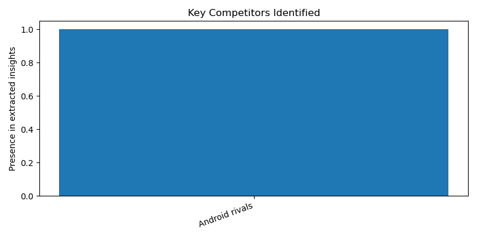

# Market Analysis Report

**Product:** Iphone 13  
**Region:** US

---

## Executive Summary

Market Analysis Report: iPhone 13 in the US

1. Pricing context: The iPhone 13 has a newly reduced retail price of $699, which may impact its competitiveness in the market.

2. Key competitors: The key competitors to the iPhone 13 are Android rivals, which suggests that the main competing products are likely to be flagship Android smartphones from other brands.

3. Customer perception: The value for money on the iPhone 13 is extremely good, indicating a positive customer sentiment towards the product.

4. Market trend: The iPhone 13 is the most commonly used iPhone in the U.S. right now, with a 10% share, suggesting a strong market position for the product.

5. Strategic recommendation: Given the positive customer sentiment and strong market position, it is recommended that Apple continues to focus on highlighting the value for money of the iPhone 13 to maintain its competitiveness in the market.

Sources:
currently.att.yahoo.com
www.consumerreports.org
www.techradar.com
www.the-sun.com
www.youtube.com

---

## Structured Insights

### Pricing Context
The iPhone 13 has a newly reduced retail price of $699

### Key Competitors
Android rivals

### Customer Sentiment
The value for money on the iPhone 13 is extremely good

### Market Trend
The iPhone 13 is the most commonly used iPhone in the U.S. right now, with a 10% share

### Confidence Note
Evidence is limited, but suggests a positive customer sentiment and strong market position for the iPhone 13

---

## Visualizations

### Customer Sentiment Overview

### Competitor Overview

---

## Sources

- currently.att.yahoo.com
- www.consumerreports.org
- www.techradar.com
- www.the-sun.com
- www.youtube.com
