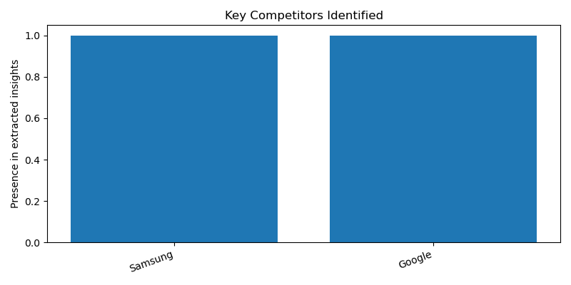

# Market Analysis Report

**Product:** Iphone 16  
**Region:** US

---

## Executive Summary

**Market Analysis Report: iPhone 16 in the US**

**1. Pricing Context**
The iPhone 16 is priced starting at $799, with a notable discount of 25% compared to a higher-end model. Additionally, the iPhone 16e is available at a lower price point of $599. This pricing strategy may be aimed at attracting a wider range of customers.

**2. Key Competitors**
The key competitors in the US market for the iPhone 16 are Samsung and Google. These competitors are established players in the smartphone industry and are likely to influence the market dynamics.

**3. Customer Perception**
Unfortunately, there is no clear sentiment expressed by customers regarding the iPhone 16. This lack of information makes it challenging to gauge customer perception and preferences.

**4. Market Trend**
There is no clear trend expressed in the market, making it difficult to predict future developments. The absence of explicit information on market trends limits our understanding of the current landscape.

**5. Strategic Recommendation**
Given the limited evidence and lack of explicit information on competitors and trends, it is challenging to provide a definitive strategic recommendation. However, it is essential to continue monitoring the market and customer sentiment to inform future decisions.

**Sources**
- nztechpodcast.com
- www.cnet.com
- www.laptopmag.com
- www.tomsguide.com
- www.youtube.com

---

## Structured Insights

### Pricing Context
The iPhone 16 starts at $799, with a discount of 25% compared to a higher-end model, and the iPhone 16e starts at $599

### Key Competitors
Samsung, Google

### Customer Sentiment
No clear sentiment expressed

### Market Trend
No clear trend expressed

### Confidence Note
Weak evidence, competitors and trends not explicitly mentioned in the context

---

## Visualizations

### Customer Sentiment Overview

### Competitor Overview

---

## Sources

- nztechpodcast.com
- www.cnet.com
- www.laptopmag.com
- www.tomsguide.com
- www.youtube.com
