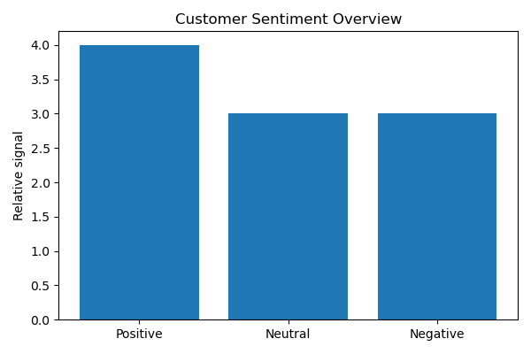

# Market Analysis Report

**Product:** MSI  thin 15 laptop  
**Region:** US

---

## Executive Summary

**Market Analysis Report: MSI Thin 15 Laptop in the US**

1. **Pricing Context**: The MSI Thin 15 laptop is positioned as a budget-friendly option, notably being the cheapest 15-inch gaming laptop available. This pricing strategy is likely to appeal to cost-conscious consumers seeking a affordable gaming experience.

2. **Key Competitors**: Unfortunately, due to limited information, key competitors in the market for the MSI Thin 15 laptop cannot be identified at this time.

3. **Customer Perception**: Customer sentiment around the MSI Thin 15 laptop reveals concerns about quality control, specifically regarding the durability and reliability of screen hinges. Addressing these concerns could be crucial for improving customer satisfaction and loyalty.

4. **Market Trend**: There is a noted demand for portable, lightweight gaming laptops. This trend suggests that the MSI Thin 15 laptop, with its thin design, could capitalize on this market preference. However, it's essential to note that the evidence supporting this trend is weak, and more research is needed to fully understand the market dynamics.

5. **Strategic Recommendation**: Given the budget-friendly positioning and the demand for portable gaming laptops, it is recommended that MSI focuses on enhancing quality control measures, particularly for screen hinges, to alleviate customer concerns. Additionally, emphasizing the laptop's portability and lightweight design in marketing efforts could help capitalize on current market trends. However, these recommendations are made with the caveat that the evidence is limited, and further market research is advised to confirm these insights.

**Sources**:
- laptopmedia.com
- www.amazon.com
- www.reddit.com
- www.youtube.com

---

## Structured Insights

### Pricing Context
budget-friendly, cheapest 15-inch gaming laptop

### Key Competitors
No clear competitors identified.

### Customer Sentiment
concerns about quality control, specifically screen hinges

### Market Trend
demand for portable, lightweight gaming laptops

### Confidence Note
weak evidence, limited information about competitors and market trends

---

## Visualizations

### Customer Sentiment Overview

### Competitor Overview

---

## Sources

- laptopmedia.com
- www.amazon.com
- www.reddit.com
- www.youtube.com
