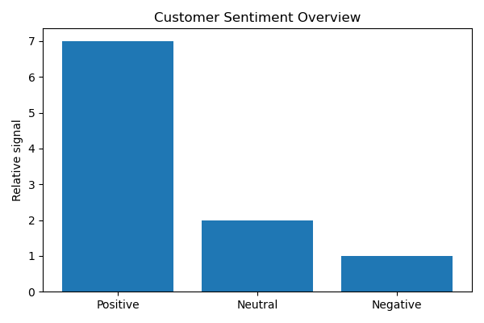
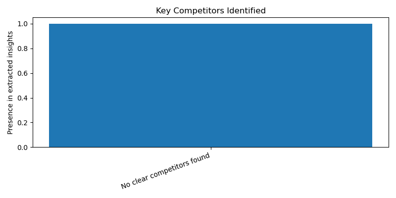

# Market Analysis Report

**Product:** MSI  thin 15 laptop  
**Region:** US

---

## Executive Summary

1. Pricing context: The MSI thin 15 laptop is priced incredibly cheap for a gaming laptop, making it an attractive option for budget-conscious consumers.

2. Key competitors: Unfortunately, there is no clear evidence of direct competitors, as no specific alternative products are mentioned in the available information.

3. Customer perception: Customer sentiment towards the MSI thin 15 laptop is positive, indicating a favorable reception among consumers.

4. Market trend: The current market trend favors gaming laptops with high-quality visuals and playable frame rates, which suggests that the MSI thin 15 laptop is well-positioned to capitalize on this trend.

5. Strategic recommendation: Given the positive customer sentiment and favorable market trend, it is recommended that MSI continue to focus on offering high-quality gaming laptops at competitive prices to maintain its market position.

Sources:
laptopmedia.com
www.amazon.com
www.reddit.com
www.youtube.com

---

## Structured Insights

### Pricing Context
incredibly cheap for a gaming laptop

### Key Competitors
No clear competitors identified.

### Customer Sentiment
positive

### Market Trend
gaming laptops with high-quality visuals and playable frame rates

### Confidence Note
weak evidence, limited information about competitors and market trends

---

## Visualizations

### Customer Sentiment Overview

### Competitor Overview

---

## Sources

- laptopmedia.com
- www.amazon.com
- www.reddit.com
- www.youtube.com
