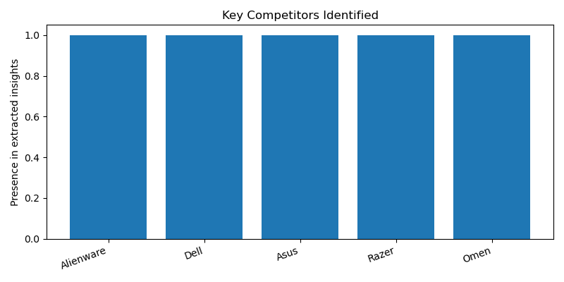

# Market Analysis Report

**Product:** MSI 15 laptop thin  
**Region:** US

---

## Executive Summary

**Market Analysis Report: MSI 15 Laptop Thin in the US**

1. **Pricing Context**
The MSI 15 laptop thin operates in a market where low-cost laptops typically cost well below $1000. This pricing context suggests that affordability is a key consideration for consumers in this segment.

2. **Key Competitors**
The key competitors in this market include Alienware, Dell, Asus, Razer, and Omen. These brands are well-established in the laptop market and offer a range of products that cater to different consumer needs and preferences.

3. **Customer Perception**
Customer sentiment towards the MSI 15 laptop thin is neutral. This suggests that consumers have mixed opinions about the product, and there may be opportunities for improvement in terms of features, performance, or overall value proposition.

4. **Market Trend**
There is a growing demand for thin-and-light gaming laptops in the US market. This trend suggests that consumers are looking for laptops that offer a balance between performance, portability, and affordability.

5. **Strategic Recommendation**
Given the neutral customer sentiment and the growing demand for thin-and-light gaming laptops, we recommend that MSI focus on enhancing the features and performance of the 15 laptop thin to better meet consumer needs. However, it is essential to note that the evidence supporting these insights is limited and based on online forums and reviews, resulting in moderate confidence in our recommendations. Therefore, further research and analysis are necessary to confirm these findings and develop a more effective strategy.

**Sources**
- www.quora.com
- www.reddit.com
- www.techradar.com
- www.ultrabookreview.com
- www.youtube.com

---

## Structured Insights

### Pricing Context
low-cost laptops typically costing well below $1000

### Key Competitors
Alienware, Dell, Asus, Razer, Omen

### Customer Sentiment
neutral

### Market Trend
thin-and-light gaming laptops are in demand

### Confidence Note
evidence is limited and based on online forums and reviews, confidence is moderate

---

## Visualizations

### Customer Sentiment Overview

### Competitor Overview

---

## Sources

- www.quora.com
- www.reddit.com
- www.techradar.com
- www.ultrabookreview.com
- www.youtube.com
