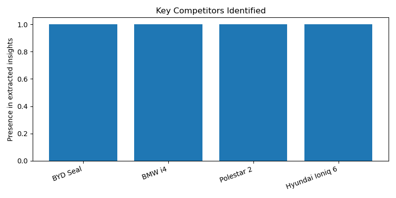

# Market Analysis Report

**Product:** Tesla Model 3  
**Region:** US

---

## Executive Summary

**Market Analysis Report: Tesla Model 3 in the US**

**1. Pricing Context**
The Tesla Model 3 operates in a pricing environment where the Hyundai Ioniq 6 is priced at $37,850. This provides a benchmark for understanding the competitive pricing landscape of electric vehicles in the US market.

**2. Key Competitors**
The key competitors to the Tesla Model 3 in the US market include the BYD Seal, BMW i4, Polestar 2, and Hyundai Ioniq 6. These models represent a range of electric vehicle options available to consumers, potentially influencing purchasing decisions.

**3. Customer Perception**
Some customers are expressing interest in alternatives to the Tesla Model 3, indicating a degree of dissatisfaction or a desire for variety in the electric vehicle market. This sentiment suggests that while the Tesla Model 3 has a significant presence, there is room for other models to attract customers.

**4. Market Trend**
The US electric vehicle market is characterized by the availability of several alternatives, suggesting a trend towards diversification and increased competition. This trend may impact the market share of the Tesla Model 3 as consumers have more options to choose from.

**5. Strategic Recommendation**
Given the moderate confidence in these insights, derived from limited evidence primarily based on a few online articles, it is recommended that Tesla continue to monitor customer sentiment and competitor activity closely. Adapting to the evolving market trends and customer preferences will be crucial in maintaining the Model 3's competitive edge. However, due to the limited nature of the evidence, these recommendations should be considered with caution and supplemented with further research for higher confidence decision-making.

**Sources**
- www.carmagazine.co.uk
- www.pcmag.com
- www.reddit.com
- www.roadandtrack.com
- www.youtube.com

---

## Structured Insights

### Pricing Context
The Hyundai Ioniq 6 is priced at $37,850

### Key Competitors
BYD Seal, BMW i4, Polestar 2, Hyundai Ioniq 6

### Customer Sentiment
Some customers are looking for alternatives to Tesla Model 3

### Market Trend
There are several electric alternatives available in the market

### Confidence Note
Evidence is limited to a few online articles, confidence in insights is moderate

---

## Visualizations

### Customer Sentiment Overview

### Competitor Overview

---

## Sources

- www.carmagazine.co.uk
- www.pcmag.com
- www.reddit.com
- www.roadandtrack.com
- www.youtube.com
